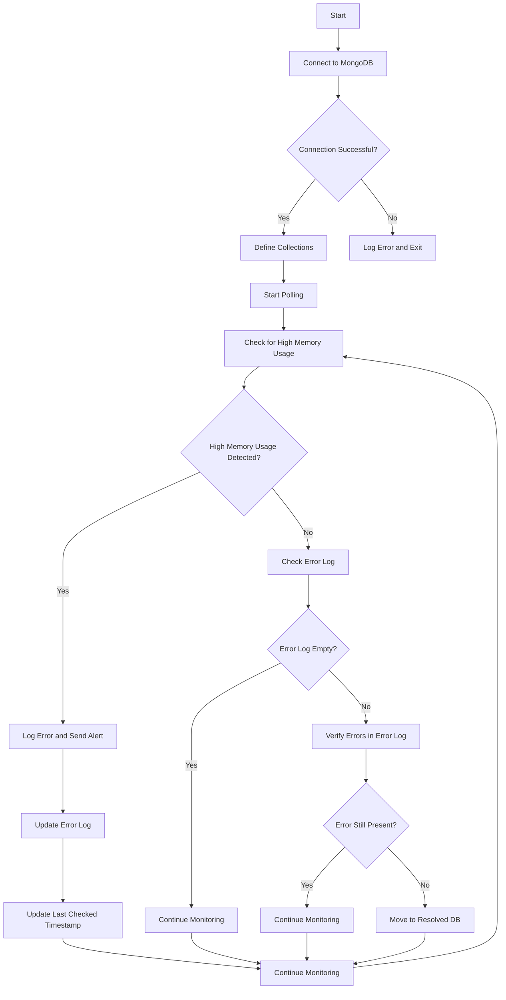

# Registration Demo

This registration / MVP demo outlines the process from node registration to monitoring & error resolution. The system that includes a frontend, backend, and an error detection engine. 
The frontend is built with React and Next.js, while the backend is built with Express.js and ethers.js for interacting with a smart contract.

## Table of Contents

- [Project Structure](#project-structure)
- [Prerequisites](#prerequisites)
- [Installation](#installation)
- [Running the Backend](#running-the-backend)
- [Running the Frontend](#running-the-frontend)
- [Running the Error Detection Engine](#running-the-error-detection-engine)
- [Endpoints](#endpoints)
- [Frontend Pages](#frontend-pages)
- [Debugging](#debugging)
- [Conclusion](#conclusion)

## Project Structure

```
registration_demo/
├── backend/
│   ├── server.js
│   ├── error_engine.js
│   └── .env
├── registration_fe/
│   ├── src/
│   │   ├── app/
│   │   │   ├── page.tsx
│   │   │   ├── gpu-info/
│   │   │   │   └── page.tsx
│   │   │   ├── home/
│   │   │   │   └── page.tsx
│   │   │   ├── register/
│   │   │   │   └── page.tsx
│   ├── package.json
│   └── next.config.js
├── README.md
└── package.json
```

## Prerequisites

- Node.js (v14 or higher)
- npm or yarn
- A valid Sei private key for interacting with the smart contract

## Installation

1. Clone the repository:
    ```sh
    git clone https://github.com/your-username/registration_demo.git
    cd registration_demo
    ```

2. Install dependencies for the backend:
    ```sh
    cd backend
    npm install
    ```

3. Install dependencies for the frontend:
    ```sh
    cd ../registration_fe
    npm install
    ```

## Running the Backend

1. Create a `.env` file in the `backend` directory with the following content:
    ```
    PKEY=your_sei_private_key
    MONGODB_URI=your_uri
    ```

2. Start the backend server:
    ```sh
    cd backend
    node server.js
    ```

    The backend server will start on port 3001.

## Running the Frontend

1. Start the frontend development server:
    ```sh
    cd registration_fe
    npm run dev
    ```

    The frontend server will start on port 3000.

## Running the Error Detection Engine

1. Start the error detection engine:
    ```sh
    cd backend
    node error_engine.js
    ```

    The error detection engine will start and listen for errors.

## Endpoints

### Backend Endpoints

- **GET /node-status/:nodeId**
    - Fetches the on-chain status of a GPU node by node ID.
    - Example response:
        ```json
        {
            "success": true,
            "message": "Node status fetched successfully",
            "data": {
                "admin": "0xDAFAebb8090Db6bd57ceb25586acB6825C0d1b19",
                "networkId": "0",
                "providerId": "1010219161",
                "registrationTime": "2025-02-11T21:42:54.000Z",
                "location": "2832984389432",
                "status": 0, // PENDING 
                "verificationOutput": "",
                "deployedContract": "0x0000000000000000000000000000000000000000"
            }
        }
        ```

- **POST /register**
    - Registers a new GPU node on our deployed smart contract (0x48baa64bCcDDD1E97BA30C6f1eFFFb01DE4182e5)
    - Example request body:
        ```json
        {
            "networkId": "1",
            "providerId": "123456",
            "location": "78910",
            "gpus": [
                {
                    "name": "RTX4090",
                    "ram": "8",
                    "gpu_uuid": "uuid1"
                }
            ]
        }
        ```

    - Example response:
        ```json
        {
            "success": true,
            "message": "GPU node registered successfully",
            "data": {
                "transactionHash": "0x...",
                "nodeId": "1",
                "status": 0,
                "details": {
                    "admin": "0x...",
                    "networkId": "1",
                    "providerId": "123456",
                    "registrationTime": "2025-02-11T21:42:54.000Z",
                    "location": "78910",
                    "verificationOutput": "",
                    "deployedContract": "0x0000000000000000000000000000000000000000"
                }
            }
        }
        ```

## Frontend Pages

- **Home Page (page.tsx)**
  - The landing page of the application.
  - Provides an overview and navigation to other pages.

- **Login Page (/login)**
  - Allows users to enter a Node ID and check its on-chain status.
  - On pending status, redirects to the GPU Info page with the node data.
  - On verified status, should redirect to their dashboard. 

- **GPU Info Page (/gpu-info)**
  - Displays detailed information about the GPU node based on the data passed from the login page.
  - should provide steps for verification

- **Registration Page (/register)**
  - Allows users to register a new GPU node.
  - Collects necessary information such as network ID, provider ID, location, and GPU details.
  - Submits tx on-chain using admin wallet abstracted from the compute provider

## Error Detection Engine Flowchart

The following flowchart illustrates the process of the error detection engine:



## Explanation

1. **Start**: The error detection engine starts and attempts to connect to MongoDB.
2. **Connect to MongoDB**: The engine connects to the MongoDB database.
3. **Connection Successful?**: If the connection is successful, it defines the collections. If not, it logs an error and exits.
4. **Define Collections**: The engine defines the `gpu_polling`, `error_log`, and `resolved_db` collections.
5. **Start Polling**: The engine starts polling for errors.
6. **Check for High Memory Usage**: The engine checks for high memory usage in the `gpu_polling` collection.
7. **High Memory Usage Detected?**: If high memory usage is detected, it logs the error and sends an alert. If not, it checks the error log.
8. **Log Error and Send Alert**: The engine logs the error in the `error_log` collection and sends an alert to the frontend.
9. **Update Error Log**: The engine updates the error log with the new high usage document.
10. **Update Last Checked Timestamp**: The engine updates the last checked timestamp to the latest processed document.
11. **Check Error Log**: The engine checks if the error log is empty.
12. **Error Log Empty?**: If the error log is empty, it continues monitoring. If not, it verifies the errors in the error log.
13. **Verify Errors in Error Log**: The engine verifies if the errors in the error log are still present.
14. **Error Still Present?**: If the error is still present, it continues monitoring. If not, it moves the error to the resolved DB.
15. **Move to Resolved DB**: The engine moves the resolved error to the `resolved_db` collection.
16. **Continue Monitoring**: The engine continues monitoring for errors.

